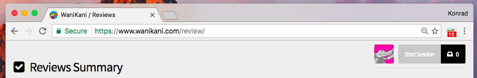

WaniKani New Reviews Notifier
======================

Features
--------

- Displays the number of minutes until your next review(s)
- Click the icon to open WaniKani

Installation
------------

Manual installation (for now):

1. Download or `git clone https://github.com/klistwan/wanikani-notifications`
2. Open Chrome extensions and click on the `Load unpacked extension` button
3. Select the downloaded directory

Contributing
------------

1. Check the open issues or open a new issue to start a discussion around
   your feature idea or the bug you found
2. Fork the repository, make your changes, and add yourself to [Authors.md][]
3. Send a pull request

If your PR has been waiting a while, feel free to [ping me on Twitter](http://twitter.com/klistwan).

[authors.md]: AUTHORS.md